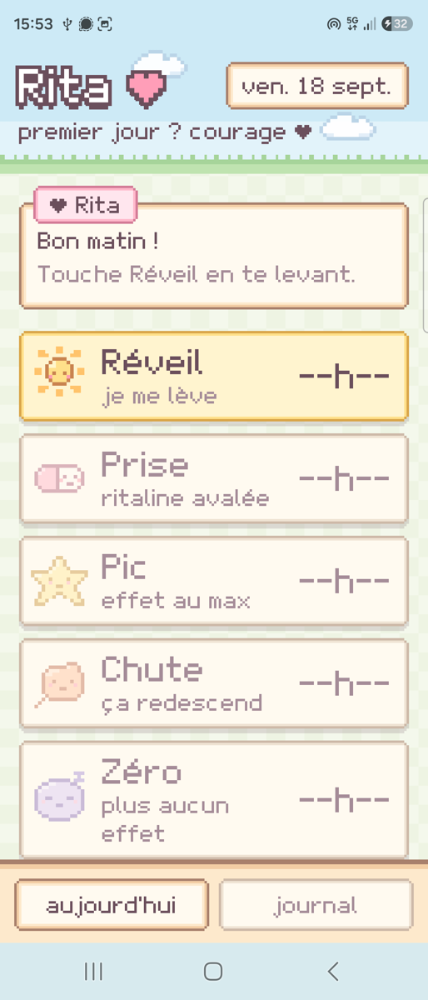
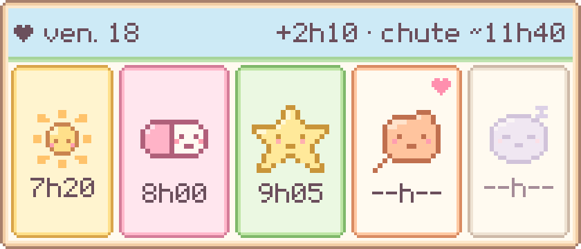
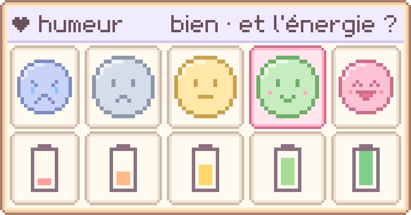

# Rita ♥

Petit carnet Android pour suivre sa Ritaline et son humeur au quotidien, en pixel art pastel façon vieux Harvest Moon.

<p>
  
  &nbsp;
  
</p>
<p></p>

## Ce que ça fait

- **Rita** : 5 étapes par jour (réveil, prise, pic, chute, zéro effet). Un tap note l'heure, un autre la corrige.
- **Humeur** : 5 têtes pour l'humeur, 5 piles pour l'énergie, autant de fois que tu veux dans la journée.
- **Deux widgets** pour l'écran d'accueil : un tap enregistre, sans ouvrir l'app.
- **Journal** : moyennes, durée d'effet par jour, courbe type, humeur par jour et humeur selon la phase du traitement.
- **Prévisions** : pic, chute et fin d'effet estimés d'après tes moyennes.
- **Privé** : aucune connexion internet, aucune sauvegarde cloud. Export / import JSON pour garder une copie.

## Installer

Télécharge `Rita-x.y.z.apk` dans les [Releases](../../releases), ouvre-le sur le téléphone et autorise l'installation.
Android 8.0 minimum. Les mises à jour s'installent par-dessus sans perdre les données.

## Compiler

```bash
python tools/make_assets.py      # police pixel, sprites, icône
python tools/widget_preview.py   # aperçus des widgets
./gradlew assembleRelease
```

L'interface est en HTML/CSS/JS dans `app/src/main/assets/www/` (prévisualisable dans un navigateur).
Les widgets sont dessinés en Java (`WidgetRenderer.java`, `MoodRenderer.java`). Police et sprites sont faits maison.

---

Rita est un outil de suivi personnel, pas un dispositif médical. Les questions sur le traitement se posent à ton médecin.
