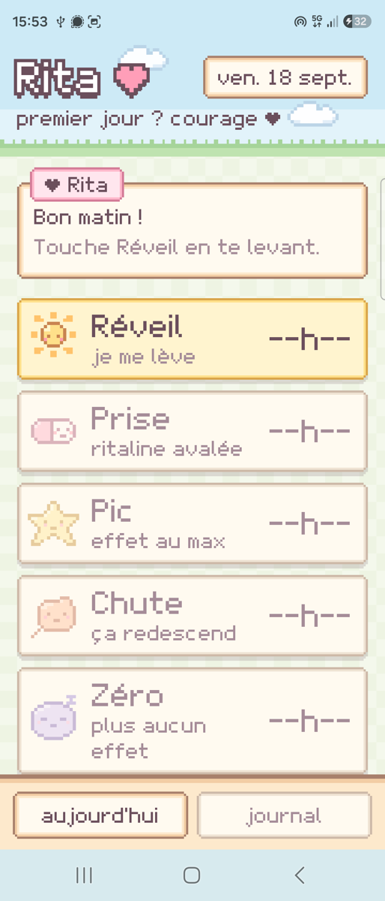
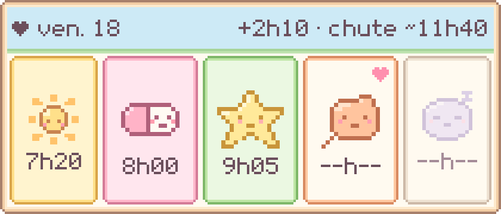
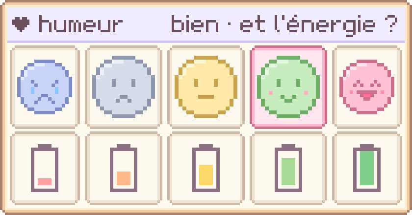

# Rita ♥

Petit carnet Android pour suivre sa Ritaline et son humeur au quotidien, en pixel art pastel façon vieux Harvest Moon.

<p>
  
  &nbsp;
  
</p>
<p></p>

## Ce que ça fait

- **Rita** : 5 étapes par jour (réveil, prise, pic, chute, zéro effet). Un tap note l'heure, un autre la corrige.
- **Autres traitements** : ajoute tes médicaments (tous les jours ou si besoin), un tap note la prise.
- **Humeur** : 5 têtes pour l'humeur, 5 piles pour l'énergie, autant de fois que tu veux dans la journée, avec des raisons possibles (tu peux ajouter les tiennes).
- **Crises d'angoisse** : un tap note le début, puis intensité de 1 à 5, symptômes, raisons possibles et ce qui a aidé. Un écran « respirer » (5 s / 5 s) et un raccourci « Crise » sur l'icône (appui long).
- **Deux widgets** pour l'écran d'accueil : un tap enregistre, sans ouvrir l'app.
- **Journal** : calendrier du mois, constats en phrases, durée d'effet, courbe type, humeur jour par jour et selon l'heure, humeur selon le contexte, crises par heure, phase et raison. Période 7 jours, 30 jours ou tout.
- **Prévisions** : pic, chute et fin d'effet estimés d'après tes moyennes.
- **Privé** : aucune connexion internet, aucune sauvegarde cloud. Export / import JSON pour garder une copie.

## Installer

Télécharge `Rita-x.y.z.apk` dans les [Releases](../../releases), ouvre-le sur le téléphone et autorise l'installation.
Android 8.0 minimum. Les mises à jour s'installent par-dessus sans perdre les données.

## Compiler

```bash
python tools/make_assets.py      # police pixel, sprites, icône
python tools/widget_preview.py   # aperçus des widgets
./gradlew assembleRelease
```

L'interface est en HTML/CSS/JS dans `app/src/main/assets/www/` (prévisualisable dans un navigateur).
`app.js` est le cœur ; `meds.js`, `crises.js` et `journal.js` sont les modules. `tools/demo_data.js` remplit l'aperçu avec 60 jours de fausses données.
Les widgets sont dessinés en Java (`WidgetRenderer.java`, `MoodRenderer.java`). Police et sprites sont faits maison.

---

Rita est un outil de suivi personnel, pas un dispositif médical. Les questions sur le traitement se posent à ton médecin.
